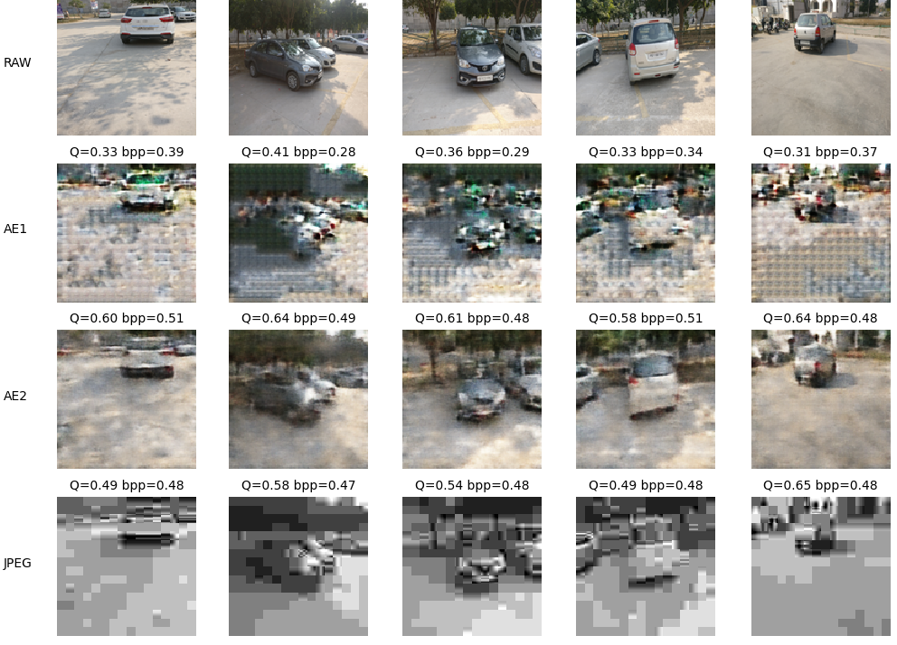

# Учебный проект, посвященный сжатию изображений при помощи автокодировщика

## Описание работы кодека
Данный простой кодек сжимает изображения размером 128x128 при помощи автокодировщика, квантования и адаптивного арифметического кодирования.
В папке ./train/ находятся изображения, которые были использованы для обучения сети, в папке ./test/ находятся изображения для демонстрации результатов.

Структура кодера:
1. Слой 1. Принимает x размером 128x128x3. Выполняет свёртку 7x7, ReLu, AveragePooling2D 2x2. На выходе вектор y1 размером 64x64x128.
2. Слой 2. Принимает y1. Выполняет свёртку 5x5, ReLu, AveragePooling2D 2x2. На выходе вектор y2 размером 32x32x32.
3. Слой 3. Принимает y2. Выполняет свёртку 3x3, ReLu, AveragePooling2D 2x2. На выходе вектор y3 размером 16x16x16.
4. Выполняется батч нормализация.
5. Вычисление максимума $y_{max} = \max_i{y^i_3}$.
6. Квантование x_i = \left\lfloor clip(y^i_3/y_{max},[0,1))\cdot 2^b\right\rfloor, в результате которого x_i \in \{0,1,...,2^{b}-1\}.
7. Сжатие {x_i} при помощи адаптивного арифметического кодера (ААК) из [1].

Структура декодера:
1. Декодирование {x_i} при помощи АAК из [1].
2. \hat y^i_3 = y_{max}\cdot\left(\frac{x_i}{2^{b}}+\frac{1}{2^{b+1}}\right)
3. Слой 1. Принимает \hat y_3. Свёртка 3\times 3, ReLu. На выходе  \hat y_2 размером 32x32x16.
4. Слой 2. Принимает \hat y_2. Свёртка 5\times 5, ReLu. На выходе  \hat y_1 размером 64x64x32.
4. Слой 3. Принимает \hat y_1. Свёртка 7\times 7, ReLu. На выходе  изображение \hat x размером 128x128x3.

На следующем примере показано сравнение эффективности работы данной модели, при b=2. Здесь RAW помечена строка исходных изображений,
AE1 -- автокодировщик без добавления шума при обучении, AE2 -- автокодировщик c добавлением шума при обучении,
JPEG -- алгоритм JPEG в котором степень сжатия подобрана так, чтобы быть близкой к тому, что достигают автокодировщики.
Здесь Q -- это метрика качества изображения SSIM, а bpp -- это число бит на пиксель после сжатия (в исходном формате bpp=24).

Как можно заметить, автокодировщик AE2 выигрывает у JPEG по качеству на высоких степенях сжатия.  Также, пример показывает
важность добавления шума при обучении, вследствие чего автокодировщик адаптируется к ошибке квантования.

ААК из [1] реализован на языке Си и подключается к коду как библиотека. Для сборки модуля необходимо выполнить команды, которые находятся в файле
EntropyCompile.bat

Код протестирован на OC Windows 10 и Ubuntu 24.

## Описание задания к лабораторной работе
Улучшить учебный кодек так, чтобы он:
- либо на том же сжатии показывал лучшее субъективное визуальное качество; 
- либо на том же сжатии обеспечивал выигрыш по SSIM от 0.05 и выше;
- либо при том же уровне качества обеспечивал от 3\% выигрыша по bpp.

Можно улучшать следующие модули:
- Арифметический кодер (учесть возможную память источника, оценка вероятностей); 
- Квантование (векторное квантование, использовать другую модель шума при обучении и т.д.);
- Нейронная сеть (количество слоёв, функции активации, связи между слоями и т.д.).

Требования к реализации:
- Результаты должны быть продемонстрированы на изображениях из папки ./test/
- При обучении должны использоваться только изображения из папки ./train/
- При сравнении заменить строчку изображений автокодировщика AE1 на результаты разработанного кодека как показано на рисунке выше.
- Построить график функции средний SSIM/bpp для тестовых изображений для b=2,3,4,5 для AE2, JPEG и предложенного кодека.

На почту eabelyaev@itmo.ru прислать отчет в виде презентации в pdf формате, который включает в себя:
- ФИО студента, номер группы.
- Описание предложенной модификации и результаты.
- Ссылку на репозиторий с исходным кодом кодека и инструкцию по запуску.

## Литература
[1] Ian H. Witten, Radford M. Neal, and John G. Cleary, “Arithmetic coding for data compression,” Commun. ACM, 1987.